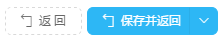
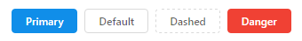

本文档例子皆为语法[ES6](http://192.168.1.6:8000/es6/)语法

###代码规范
@(变量定义)[代码布局|代码注释|Jsx]
- 系统变量，类变量，组件名都需要大驼峰命名规则。`例：UserName`
- 局部变量，函数需要小驼峰命名规则。`例：userName`
- 常量，某些作为不允许修改的变量认为是常量，全部字母都大写。`例：COPYRIGHT`常量可以存在于函数中，也可以存在于全局。
- 函数命名，统一使用动词或者动词[+名词]形式，例如：```handleClick```, ```getVersion```, ```submitForm```, ```init```, 异步方法使用```fetch```后缀```userFetch```，涉及返回逻辑值的函数可以使用```is```，```has```等表示逻辑的词语代替动词。
- 代码行长度应尽量小于80个字符，如果有层级关系的代码换行时则需要缩进2个空格，情况可也可由代码实际情况自行排版，原则为代码阅读性高，看着清爽即可。
- 代码之间的逻辑提倡尽量使用 `===`
- 代码添加注释时，函数（代码块）需加上功能说明，有必要时还需备注参数说明，尽可能保证其他开发人员能够快速理解函数功能及其使用方法。函数间间隔两行，函数内部如果涉及了两个功能块，则需要间隔一行。例：

        // 函数1---type（1:开始，2:结束）
        () => {
	    	// 功能1
	    	code...
	    
	    	// 功能2
	    	code...
	     }
    
    
	    // 函数2
	    () => {
			code...
	    }

> ####特殊处理
    如果三元运算公式过长则可写成：
    1 === 1
    ? code... 
    : code...
> ####注意事项
 所有命名最好使用英语。
 所有变量应该明确，尽量可以从字面意思解读
 避免双重定义变量，例：`isNotError`
 避免条件中执行语句， 例：`if ( getUserNum() > 2 ) { code... }`
   
#####jsx 书写规范

**自闭合**

```
// bad
<Foo className="stuff"></Foo>

// good
<Foo className="stuff" />
```

**换行**

```
// bad
<Foo superLongParam="bar"
  anotherSuperLongParam="baz" />

// good
<Foo
  superLongParam="bar"
  anotherSuperLongParam="baz" />

// 如果属性可以放在一行内就不要换行
<Foo bar="bar" />

// good
// 单行时可取
render () {
  const body = <div>hello</div>;
  return <MyComponent>{body}</MyComponent>;
}
```

**Quotes(引号)**
对于JSX的属性用双引号表示，对于其他属性，用单引号表示。
```
// bad
<Foo bar='bar' />

// good
<Foo bar="bar" />

// bad
<Foo style={{ left: "20px" }} />

// good
<Foo style={{ left: '20px' }} />
```

**Spacing(空格)**
在自闭合的标签中仅使用单空格。

```
// bad
<Foo/>

// very bad
<Foo                 />

// bad
<Foo
 />

// good
<Foo />
```

**多段**
当JSX包含多行代码时，将它们包含在小括号中。

```
// bad
render () {
  return <MyComponent className="long body" foo="bar">
           <MyChild />
         </MyComponent>;
}

// good
render () {
  return (
    <MyComponent className="long body" foo="bar">
      <MyChild />
    </MyComponent>
  );
}

// good, when single line
render () {
  const body = <div>hello</div>;
  return <MyComponent>{body}</MyComponent>;
}
```

###页面布局规范
@[浏览|编辑|弹出层]
+ **浏览类布局(界面以表格为主要展示数据方式)**
1. 返回的数据默认左对齐，是等宽的数据居中对齐（例如账号，性别等），金额等数值类型的数据右对齐。
2. 最后一列操作栏需要给定最小宽度，且各操作功能项左右间隔空10px，中间竖线隔开，如果有删除项则把删除放置到最后一项。

+ **弹出层**
1. 弹出层有form表单控件时用value属性，不要使用initalValue属性，因为弹出层是隐藏与显示状态切换显示的，且initalValue值只在组件第一次render时生效。
2. 弹出层第一个组件如果是可编辑的文本组件则自动获取焦点。

+ **编辑类布局**
1. 编辑界面顶部操作按钮使用规则：如果页面有返回功能，第一个则为返回按钮，按钮类型规定为dashed第二个一般来说放置保存作为主按钮，其它顺延为次按钮。或根据界面需求还有一种方式为，第二个按钮为按钮分组，可自由组合功能。
按钮组图片示例：
2. 一般的编辑页面会使用表单形式，当表单字段过多时，可设计成 2~3 列，使用栅格布局，栅格布局时一般定宽800px，特殊情况除外。
3. 编辑页初始化完成以后第一个编辑组建为文本类编辑组件则需自动获取焦点。
4. 页面的加载效果规则：页面需要的全部数据加载完成再将页面的加载状态置为false。例如：当页面需要用两条命令加载完成后才算页面加载完成时，不能写成每次一条命令加载完成就重置页面的loading状态，这样容易产生页面的加载动作间隙，正确做法应该是将命令统一管理，然后操作页面loading状态。

> **注意：**页面按钮使用规则：
按钮有四种类型：主按钮、次按钮、虚线按钮、危险按钮。主按钮在同一个操作区域最多出现一次。
>```danger 在 antd@2.7 后支持。早期版本没有```


###常用函数API

###已封装公共组件

###页面的全局样式配置（淘宝组件antd）
antd@2.4.3 的 less 变量

```less
// Prefix
@ant-prefix             : ant;

// Color
@primary-color          : #108ee9;
@success-color          : #87d068;
@error-color            : #f50;
@highlight-color        : #f50;
@warning-color          : #fa0;
@normal-color           : #d9d9d9;

// ------ Base & Require ------
@body-background        : #fff;
@font-family            : -apple-system, BlinkMacSystemFont, "Segoe UI", Roboto, "Helvetica Neue", Helvetica, "PingFang SC", "Hiragino Sans GB", "Microsoft YaHei", SimSun, sans-serif;
@code-family            : Consolas,Menlo,Courier,monospace;
@text-color             : #666;
@heading-color          : #404040;
@text-color-secondary   : #999;
@font-size-base         : 12px;
@font-size-lg           : @font-size-base + 2px;
@line-height-base       : 1.5;
@border-radius-base     : 4px;
@border-radius-sm       : 2px;

// ICONFONT
@iconfont-css-prefix    : anticon;
@icon-url               : "https://at.alicdn.com/t/font_uarbhgk1h908jjor";

// LINK
@link-color             : #108ee9;
@link-hover-color       : tint(@link-color, 20%);
@link-active-color      : shade(@link-color, 5%);
@link-hover-decoration  : none;

// Animation
@ease-out            : cubic-bezier(0.215, 0.61, 0.355, 1);
@ease-in             : cubic-bezier(0.55, 0.055, 0.675, 0.19);
@ease-in-out         : cubic-bezier(0.645, 0.045, 0.355, 1);
@ease-out-back       : cubic-bezier(0.12, 0.4, 0.29, 1.46);
@ease-in-back        : cubic-bezier(0.71, -0.46, 0.88, 0.6);
@ease-in-out-back    : cubic-bezier(0.71, -0.46, 0.29, 1.46);
@ease-out-circ       : cubic-bezier(0.08, 0.82, 0.17, 1);
@ease-in-circ        : cubic-bezier(0.6, 0.04, 0.98, 0.34);
@ease-in-out-circ    : cubic-bezier(0.78, 0.14, 0.15, 0.86);
@ease-out-quint      : cubic-bezier(0.23, 1, 0.32, 1);
@ease-in-quint       : cubic-bezier(0.755, 0.05, 0.855, 0.06);
@ease-in-out-quint   : cubic-bezier(0.86, 0, 0.07, 1);

// Border color
@border-color-base      : #d9d9d9;        // base border outline a component
@border-color-split     : #e9e9e9;        // split border inside a component

// Outline
@outline-blur-size      : 0;
@outline-width          : 2px;
@outline-color          : @primary-color;

// Background color
@background-color-base  : #f7f7f7;        // basic gray background

// Shadow
@shadow-color           : rgba(0, 0, 0, .2);
@box-shadow-base        : @shadow-1-down;
@shadow-1-up            : 0 -1px 6px @shadow-color;
@shadow-1-down          : 0 1px 6px @shadow-color;
@shadow-1-left          : -1px 0 6px @shadow-color;
@shadow-1-right         : 1px 0 6px @shadow-color;
@shadow-2               : 0 2px 8px @shadow-color;

// Buttons
@btn-font-weight        : 500;
@btn-border-radius-base : @border-radius-base;
@btn-border-radius-sm   : @border-radius-sm;

@btn-primary-color      : #fff;
@btn-primary-bg         : @primary-color;
@btn-group-border       : shade(@primary-color, 5%);

@btn-default-color      : @text-color;
@btn-default-bg         : @background-color-base;
@btn-default-border     : @border-color-base;

@btn-ghost-color        : @text-color;
@btn-ghost-bg           : transparent;
@btn-ghost-border       : @border-color-base;

@btn-disable-color      : #ccc;
@btn-disable-bg         : @background-color-base;
@btn-disable-border     : @border-color-base;

@btn-padding-base       : 4px 15px;
@btn-font-size-lg       : @font-size-lg;
@btn-padding-lg         : 4px 15px 5px 15px;
@btn-padding-sm         : 1px 7px;

@btn-circle-size        : 28px;
@btn-circle-size-lg     : 32px;
@btn-circle-size-sm     : 22px;

// Media queries breakpoints
// Extra small screen / phone
@screen-xs              : 480px;
@screen-xs-min          : @screen-xs;
@screen-xs-max          : (@screen-xs-min - 1);

// Small screen / tablet
@screen-sm              : 768px;
@screen-sm-min          : @screen-sm;
@screen-sm-max          : (@screen-sm-min - 1);

// Medium screen / desktop
@screen-md              : 992px;
@screen-md-min          : @screen-md;
@screen-md-max          : (@screen-md-min - 1);

// Large screen / wide desktop
@screen-lg              : 1200px;
@screen-lg-min          : @screen-lg;
@screen-lg-max          : (@screen-lg-min - 1);

// Layout and Grid system
@grid-columns           : 24;
@grid-gutter-width      : 0;

// z-index list
@zindex-affix           : 10;
@zindex-back-top        : 10;
@zindex-modal-mask      : 1000;
@zindex-modal           : 1000;
@zindex-notification    : 1010;
@zindex-message         : 1010;
@zindex-popover         : 1030;
@zindex-picker          : 1050;
@zindex-dropdown        : 1050;
@zindex-tooltip         : 1060;

// Animation
@animation-duration-slow: .3s; // Modal
@animation-duration-base: .2s;
@animation-duration-fast: .1s; // Tooltip

// Form
// ---
@label-required-color        : @highlight-color;
@label-color                 : @text-color;
@form-item-margin-bottom     : 24px;

// Input
// ---
@input-height-base           : 28px;
@input-height-lg             : 32px;
@input-height-sm             : 22px;
@input-padding-horizontal    : 7px;
@input-padding-vertical-base : 4px;
@input-padding-vertical-sm   : 1px;
@input-padding-vertical-lg   : 6px;
@input-placeholder-color     : #ccc;
@input-color                 : @text-color;
@input-border-color          : @border-color-base;
@input-bg                    : #fff;
@input-hover-border-color    : @primary-color;
@input-disabled-bg           : @background-color-base;

// Tooltip
// ---
//* Tooltip max width
@tooltip-max-width: 250px;
//** Tooltip text color
@tooltip-color: #fff;
//** Tooltip background color
@tooltip-bg: rgba(64, 64, 64, .85);
//** Tooltip arrow width
@tooltip-arrow-width: 5px;
//** Tooltip distance with trigger
@tooltip-distance: @tooltip-arrow-width - 1 + 4;
//** Tooltip arrow color
@tooltip-arrow-color: @tooltip-bg;

// Popover
// ---
//** Popover body background color
@popover-bg: #fff;
//** Popover maximum width
@popover-min-width: 177px;
//** Popover arrow width
@popover-arrow-width: 4px;
//** Popover arrow color
@popover-arrow-color: @popover-bg;
//** Popover outer arrow width
@popover-arrow-outer-width: (@popover-arrow-width + 1);
//** Popover outer arrow color
@popover-arrow-outer-color: fadeout(@border-color-base, 30%);

// Progress
// --
@process-default-color: @primary-color;
```

###开发工具助手
>阿里妈妈MUX倾力打造的矢量图标管理、交流平台。
设计师将图标上传到Iconfont平台，用户可以自定义下载多种格式的icon，平台也可将图标转换为字体，便于前端工程师自由调整与调用。[iconfont.cn](http://iconfont.cn/)

`一个系统应共同使用一份图标项目，多人维护图标时，由图标的第一使用人添加其他项目人员，每次添加的字体会自动合并到项目里，只需下载覆盖网站现使用图标字体即可`
+ **导入字体图标**
找到对应项目，从网站搜索到自己需要的字体，导入对应项目，下载前可根据需求自定义图标编码和样式名，且可简单调整图标样式。
+ **导入字体**
找到网站在线字体功能入口，根据网站现使用的字体定义需要导出的字体（网站自带使用方法视频）。导出的字体需要在项目里以文件的形式记录，方便后期其他维护人员修改，现在是在项目开发的根目录的`字体字符.txt`文件里记录。

>**导出字体示例（包含数字，字母，特殊字符及网站需要的中文字）**
此处填写网站需要的中文字体`1234567890-=\][poiuytrewqasdfghjkl;'/.,mnbvcxz~!@#$%^&*()_+|}{POIUYTREWQASDFGHJKL:"?><MNBVCXZ


###说一说我们开发过程中（针对淘宝组件，React）可能遇到的坑
1. **淘宝组件的defaultValue和value的区别**
渲染页面时，只有第一次render时才会设置defaultValue的值，后续的defaultValue值则会失效，即使该值产生变化也不会改变组件的值。
<br />
2. **表格组件结合验证组件使用时，注意验证组件的key值的更新**
当表格内包含了验证组件，验证组件如果有初始化的值，那么每次表格的数据产生了变化，则验证组件的key值也要跟着改变，否则如同给验证组件加了defaultValue值一样，需验证的组件值不会发生改变。


